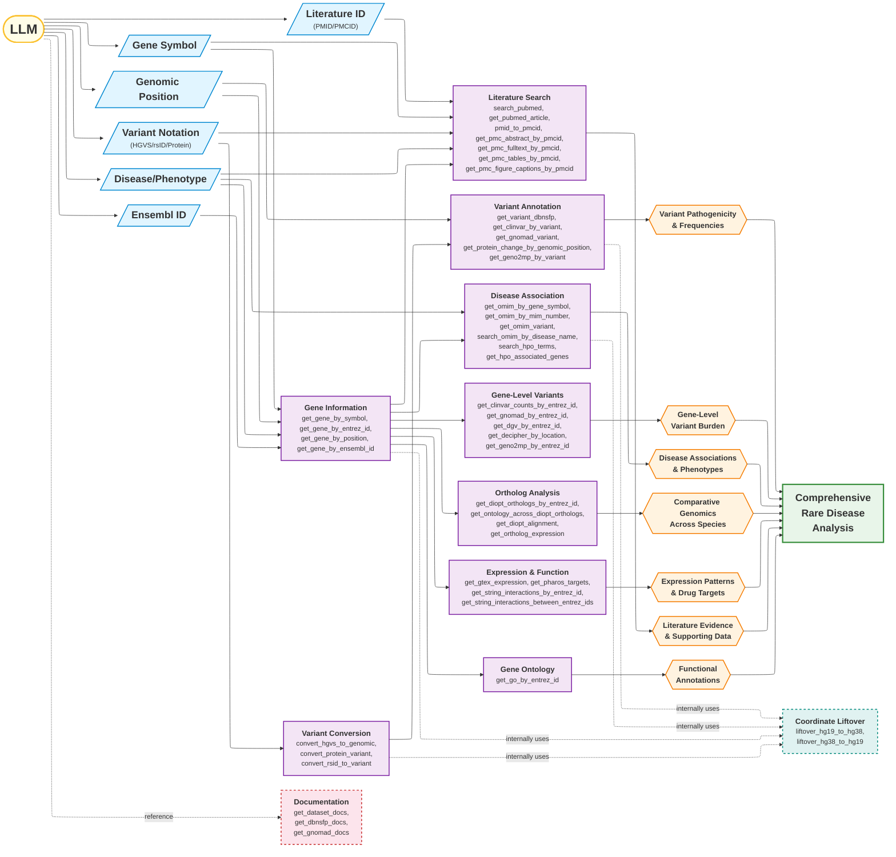

# MARRVEL MCP Tools - Relationship Graph

This diagram shows the natural flow and chaining relationships between MARRVEL MCP tools based on their inputs and outputs.



## Common Tool Chains

### Chain 1: Gene Symbol → Full Gene Analysis

```text
gene_symbol → get_gene_by_symbol → entrez_id
  → get_diopt_orthologs_by_entrez_id (comparative genomics)
  → get_gtex_expression (tissue expression)
  → get_clinvar_counts_by_entrez_id (variant burden)
  → get_string_interactions_by_entrez_id (protein network)
  → get_pharos_targets (drug targets)
  → get_go_by_entrez_id (gene ontology)
```

### Chain 2: Variant Analysis Pipeline

```text
HGVS variant → convert_hgvs_to_genomic → (chr, pos, ref, alt)
  → get_variant_dbnsfp (CADD, conservation scores)
  → get_clinvar_by_variant (clinical significance)
  → get_gnomad_variant (population frequency)
  → get_protein_change_by_genomic_position (protein change / VEP annotations)
  → get_geno2mp_by_variant (genotype-phenotype associations)
```

### Chain 3: Disease → Gene → Variant Discovery

```text
disease_name → search_omim_by_disease_name → gene_symbol
  → get_gene_by_symbol → entrez_id
  → get_clinvar_counts_by_entrez_id → variant list
  → get_clinvar_by_variant (for each variant)
```

### Chain 4: Phenotype → Gene Discovery

```text
phenotype_query → search_hpo_terms → hpo_id
  → get_hpo_associated_genes → gene list
  → get_gene_by_entrez_id (for each gene)
```

### Chain 5: Literature Deep Dive

```text
gene_symbol → search_pubmed → pmid list
  → get_pubmed_article (metadata + abstract)
  → pmid_to_pmcid → pmcid
  → get_pmc_abstract_by_pmcid (quick summary)
  → get_pmc_fulltext_by_pmcid (full text)
  → get_pmc_tables_by_pmcid (supplementary data)
  → get_pmc_figure_captions_by_pmcid (figures)
```

### Chain 6: Comparative Genomics Workflow

```text
entrez_id → get_diopt_orthologs_by_entrez_id → ortholog list
  → get_ontology_across_diopt_orthologs (for model organism)
  → get_diopt_alignment (sequence alignment)
  → get_ortholog_expression (cross-species expression)
```

### Chain 7: rsID → Clinical Interpretation

```text
rsid → convert_rsid_to_variant → (chr, pos, ref, alt)
  → get_variant_dbnsfp (pathogenicity scores)
  → get_clinvar_by_variant (clinical classification)
  → get_gnomad_variant (allele frequency)
  → get_omim_variant (disease association)
```

### Chain 8: Ensembl ID → Gene Analysis

```text
ensembl_id → get_gene_by_ensembl_id → entrez_id
  → (continues as Chain 1 from entrez_id)
```

### Chain 9: Protein-Level Variant → Genomic Annotation

```text
gene_symbol + protein_variant → convert_protein_variant → (chr, pos, ref, alt)
  → get_variant_dbnsfp (pathogenicity scores)
  → get_clinvar_by_variant (clinical significance)
  → get_protein_change_by_genomic_position (transcript-level annotation)
```

### Chain 10: Pairwise Protein Interaction Analysis

```text
gene_symbol_1 → get_gene_by_symbol → entrez_id_1
gene_symbol_2 → get_gene_by_symbol → entrez_id_2
  → get_string_interactions_between_entrez_ids (pairwise interactions)
```

## Utility Tools

### Coordinate Liftover

Several tools internally convert between genome builds. The liftover tools are also available directly:

```text
hg38 coordinates → liftover_hg38_to_hg19 → hg19 coordinates
hg19 coordinates → liftover_hg19_to_hg38 → hg38 coordinates
```

Tools that internally use liftover:
- `convert_hgvs_to_genomic` (hg19 → hg38)
- `convert_protein_variant` (hg19 → hg38)
- `get_protein_change_by_genomic_position` (hg38 → hg19)
- `get_omim_variant` (hg38 → hg19)
- `get_geno2mp_by_variant` (hg38 → hg19)
- `get_decipher_by_location` (hg38 → hg19)
- `fix_missing_hg38_vals` in gene tools (hg19 → hg38)

### Documentation Tools

Reference tools for understanding available datasets and score definitions:

```text
get_dataset_docs → descriptions of all MARRVEL datasets
get_dbnsfp_docs → descriptions of all dbNSFP prediction methods and scores
get_gnomad_docs → descriptions of gnomAD gene constraint metrics
```

## Key Decision Points

### After getting Gene Info

- **Clinical Focus**: → ClinVar, OMIM, HPO
- **Population Genetics**: → gnomAD, DGV
- **Functional**: → GTEx, DIOPT, STRING, GO
- **Therapeutic**: → Pharos (drug targets)

### After getting Variant Position

- **Pathogenicity**: → dbNSFP (computational predictions)
- **Clinical Evidence**: → ClinVar (expert curation)
- **Frequency**: → gnomAD (population data)
- **Disease Context**: → OMIM variant (disease association)
- **Phenotype Correlation**: → Geno2MP (genotype-phenotype)
- **Protein Impact**: → get_protein_change_by_genomic_position (protein change)

### After getting PMID/PMCID

- **Quick Summary**: → get_pmc_abstract_by_pmcid
- **Deep Analysis**: → get_pmc_fulltext_by_pmcid
- **Data Mining**: → get_pmc_tables_by_pmcid + get_pmc_figure_captions_by_pmcid

## Complete Tool Inventory

| Category | Tool | Description |
|---|---|---|
| **Meta** | `get_dataset_docs` | Descriptions of all MARRVEL datasets |
| **Meta** | `get_dbnsfp_docs` | Descriptions of dbNSFP prediction methods |
| **Meta** | `get_gnomad_docs` | Descriptions of gnomAD constraint metrics |
| **Gene** | `get_gene_by_symbol` | Gene info by symbol |
| **Gene** | `get_gene_by_entrez_id` | Gene info by Entrez ID |
| **Gene** | `get_gene_by_ensembl_id` | Gene info by Ensembl ID |
| **Gene** | `get_gene_by_position` | Gene info by genomic position (hg38) |
| **Variant** | `get_variant_dbnsfp` | Pathogenicity predictions (dbNSFP) |
| **Variant** | `get_clinvar_by_variant` | ClinVar clinical significance |
| **Variant** | `get_clinvar_counts_by_entrez_id` | ClinVar variant counts by gene |
| **Variant** | `get_gnomad_variant` | gnomAD population frequencies |
| **Variant** | `get_gnomad_by_entrez_id` | gnomAD gene-level data |
| **Variant** | `get_dgv_by_entrez_id` | DGV structural variants |
| **Variant** | `get_geno2mp_by_entrez_id` | Geno2MP gene-level HPO counts |
| **Variant** | `get_geno2mp_by_variant` | Geno2MP variant-level HPO terms |
| **Variant** | `get_decipher_by_location` | DECIPHER control variant stats |
| **Disease** | `get_omim_by_mim_number` | OMIM entry by MIM number |
| **Disease** | `get_omim_by_gene_symbol` | OMIM diseases by gene |
| **Disease** | `get_omim_variant` | OMIM variant disease association |
| **Disease** | `search_omim_by_disease_name` | OMIM search by disease name |
| **Disease** | `search_hpo_terms` | HPO term search |
| **Disease** | `get_hpo_associated_genes` | Genes for an HPO term |
| **Disease** | `get_go_by_entrez_id` | Gene Ontology terms |
| **Ortholog** | `get_diopt_orthologs_by_entrez_id` | Ortholog predictions |
| **Ortholog** | `get_ontology_across_diopt_orthologs` | GO terms across orthologs |
| **Ortholog** | `get_diopt_alignment` | Protein domain alignment |
| **Expression** | `get_gtex_expression` | GTEx tissue expression |
| **Expression** | `get_ortholog_expression` | Cross-species expression |
| **Expression** | `get_pharos_targets` | Drug target info |
| **Expression** | `get_string_interactions_by_entrez_id` | STRING protein interactions |
| **Expression** | `get_string_interactions_between_entrez_ids` | STRING pairwise interactions |
| **Utility** | `convert_hgvs_to_genomic` | HGVS → genomic coordinates |
| **Utility** | `convert_protein_variant` | Protein variant → genomic coordinates |
| **Utility** | `get_protein_change_by_genomic_position` | Genomic position → protein change |
| **Utility** | `convert_rsid_to_variant` | rsID → variant coordinates |
| **Utility** | `liftover_hg19_to_hg38` | hg19 → hg38 coordinate conversion |
| **Utility** | `liftover_hg38_to_hg19` | hg38 → hg19 coordinate conversion |
| **Literature** | `search_pubmed` | PubMed literature search |
| **Literature** | `get_pubmed_article` | PubMed article details |
| **Literature** | `pmid_to_pmcid` | PMID → PMCID conversion |
| **Literature** | `get_pmc_abstract_by_pmcid` | PMC abstract retrieval |
| **Literature** | `get_pmc_fulltext_by_pmcid` | PMC full text retrieval |
| **Literature** | `get_pmc_tables_by_pmcid` | PMC table extraction |
| **Literature** | `get_pmc_figure_captions_by_pmcid` | PMC figure captions |
