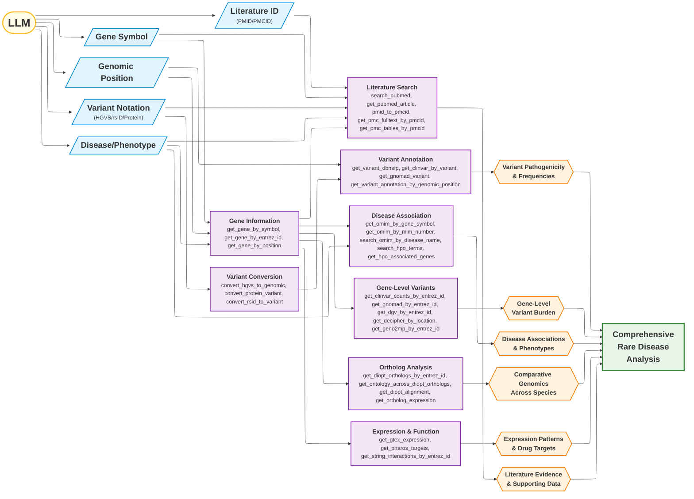

# MARRVEL MCP Tools - Relationship Graph

This diagram shows the natural flow and chaining relationships between MARRVEL MCP tools based on their inputs and outputs.



## Common Tool Chains

### Chain 1: Gene Symbol → Full Gene Analysis

```text
gene_symbol → get_gene_by_symbol → entrez_id
  → get_diopt_orthologs_by_entrez_id (comparative genomics)
  → get_gtex_expression (tissue expression)
  → get_clinvar_counts_by_entrez_id (variant burden)
  → get_string_interactions_by_entrez_id (protein network)
  → get_pharos_targets (drug targets)
```

### Chain 2: Variant Analysis Pipeline

```text
HGVS variant → convert_hgvs_to_genomic → (chr, pos, ref, alt)
  → get_variant_dbnsfp (CADD, conservation scores)
  → get_clinvar_by_variant (clinical significance)
  → get_gnomad_variant (population frequency)
  → get_variant_annotation_by_genomic_position (VEP annotations)
```

### Chain 3: Disease → Gene → Variant Discovery

```text
disease_name → search_omim_by_disease_name → gene_symbol
  → get_gene_by_symbol → entrez_id
  → get_clinvar_counts_by_entrez_id → variant list
  → get_clinvar_by_variant (for each variant)
```

### Chain 4: Phenotype → Gene Discovery

```text
phenotype_query → search_hpo_terms → hpo_id
  → get_hpo_associated_genes → gene list
  → get_gene_by_entrez_id (for each gene)
```

### Chain 5: Literature Deep Dive

```text
gene_symbol → search_pubmed → pmid list
  → pmid_to_pmcid → pmcid
  → get_pmc_fulltext_by_pmcid (full text)
  → get_pmc_tables_by_pmcid (supplementary data)
  → get_pmc_figure_captions_by_pmcid (figures)
```

### Chain 6: Comparative Genomics Workflow

```text
entrez_id → get_diopt_orthologs_by_entrez_id → ortholog list
  → get_ontology_across_diopt_orthologs (for model organism)
  → get_diopt_alignment (sequence alignment)
  → get_ortholog_expression (cross-species expression)
```

### Chain 7: rsID → Clinical Interpretation

```text
rsid → convert_rsid_to_variant → (chr, pos, ref, alt)
  → get_variant_dbnsfp (pathogenicity scores)
  → get_clinvar_by_variant (clinical classification)
  → get_gnomad_variant (allele frequency)
  → get_omim_variant (disease association)
```

## Key Decision Points

### After getting Gene Info

- **Clinical Focus**: → ClinVar, OMIM, HPO
- **Population Genetics**: → gnomAD, DGV
- **Functional**: → GTEx, DIOPT, STRING
- **Therapeutic**: → Pharos (drug targets)

### After getting Variant Position

- **Pathogenicity**: → dbNSFP (computational predictions)
- **Clinical Evidence**: → ClinVar (expert curation)
- **Frequency**: → gnomAD (population data)
- **Context**: → OMIM (disease association)

### After getting PMID/PMCID

- **Quick Summary**: → get_pmc_abstract
- **Deep Analysis**: → get_pmc_fulltext
- **Data Mining**: → get_pmc_tables + get_pmc_figure_captions
