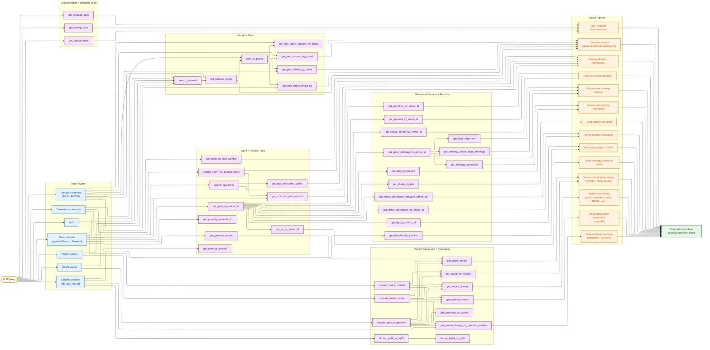

# MARRVEL MCP Tools - Detailed Connection Diagram

This diagram is a detailed, figure-style map of how user inputs can flow through individual MARRVEL MCP tools into analysis outputs.

```mermaid
---
config:
  layout: elk
---
flowchart LR
    Q([LLM Query])

    subgraph Input_Figures["Input Figures"]
        I_gene["Gene identifier<br/>(symbol / Entrez / Ensembl)"]
        I_disease["Disease or phenotype"]
        I_hgvs["HGVS variant"]
        I_protein["Protein variant"]
        I_rsid["rsID"]
        I_pos["Genomic position<br/>(chr, pos, ref, alt)"]
        I_lit["Literature identifier<br/>(PMID / PMCID)"]
    end

    subgraph Gene_And_Disease_Tools["Gene + Disease Tools"]
        T_gene_symbol["get_gene_by_symbol"]
        T_gene_entrez["get_gene_by_entrez_id"]
        T_gene_ensembl["get_gene_by_ensembl_id"]
        T_gene_position["get_gene_by_position"]
        T_omim_gene["get_omim_by_gene_symbol"]
        T_omim_mim["get_omim_by_mim_number"]
        T_omim_search["search_omim_by_disease_name"]
        T_hpo_search["search_hpo_terms"]
        T_hpo_genes["get_hpo_associated_genes"]
        T_go_gene["get_go_by_entrez_id"]
    end

    subgraph Variant_Conversion_And_Annotation["Variant Conversion + Annotation"]
        T_hgvs["convert_hgvs_to_genomic"]
        T_protein_conv["convert_protein_variant"]
        T_rsid_conv["convert_rsid_to_variant"]
        T_lift_38_19["liftover_hg38_to_hg19"]
        T_lift_19_38["liftover_hg19_to_hg38"]
        T_protein_change["get_protein_change_by_genomic_position"]
        T_dbnsfp["get_variant_dbnsfp"]
        T_clinvar_var["get_clinvar_by_variant"]
        T_gnomad_var["get_gnomad_variant"]
        T_geno2mp_var["get_geno2mp_by_variant"]
        T_omim_var["get_omim_variant"]
    end

    subgraph Gene_Level_Variants_And_Function["Gene-Level Variants + Function"]
        T_clinvar_gene["get_clinvar_counts_by_entrez_id"]
        T_gnomad_gene["get_gnomad_by_entrez_id"]
        T_dgv_gene["get_dgv_by_entrez_id"]
        T_geno2mp_gene["get_geno2mp_by_entrez_id"]
        T_decipher["get_decipher_by_location"]
        T_diopt["get_diopt_orthologs_by_entrez_id"]
        T_diopt_go["get_ontology_across_diopt_orthologs"]
        T_diopt_align["get_diopt_alignment"]
        T_orth_expr["get_ortholog_expression"]
        T_gtex["get_gtex_expression"]
        T_pharos["get_pharos_targets"]
        T_string_gene["get_string_interactions_by_entrez_id"]
        T_string_pair["get_string_interactions_between_entrez_ids"]
    end

    subgraph Literature_Tools["Literature Tools"]
        T_pubmed_search["search_pubmed"]
        T_pubmed_article["get_pubmed_article"]
        T_pmid_pmcid["pmid_to_pmcid"]
        T_pmc_abs["get_pmc_abstract_by_pmcid"]
        T_pmc_full["get_pmc_fulltext_by_pmcid"]
        T_pmc_tables["get_pmc_tables_by_pmcid"]
        T_pmc_figs["get_pmc_figure_captions_by_pmcid"]
    end

    subgraph Documentation_And_Metadata_Tools["Documentation + Metadata Tools"]
        T_dataset_docs["get_dataset_docs"]
        T_dbnsfp_docs["get_dbnsfp_docs"]
        T_gnomad_docs["get_gnomad_docs"]
    end

    subgraph Output_Figures["Output Figures"]
        O_variant["Variant annotations<br/>(SIFT, PolyPhen, CADD, REVEL, etc.)"]
        O_variant_clin["Variant clinical interpretation<br/>(ClinVar + OMIM variant)"]
        O_variant_freq["Variant population frequencies<br/>(gnomAD)"]
        O_protein_change["Protein change mapping<br/>(transcript + AA effect)"]
        O_gene_stats["Gene-level variant burden"]
        O_cnv["Structural variants + CNVs"]
        O_disease["Disease details + phenotypes"]
        O_go["Gene ontology functional profile"]
        O_ortholog["Comparative ortholog analysis"]
        O_tissue["Human and ortholog expression"]
        O_drug["Drug target information"]
        O_ppi["Protein-protein interactions"]
        O_literature["Literature content<br/>(abstract/fulltext/tables/figures)"]
        O_docs["Tool + dataset documentation"]
    end

    R["Comprehensive Rare Disease Analysis Report"]

    Q --> I_gene
    Q --> I_disease
    Q --> I_hgvs
    Q --> I_protein
    Q --> I_rsid
    Q --> I_pos
    Q --> I_lit
    Q --> T_dataset_docs
    Q --> T_dbnsfp_docs
    Q --> T_gnomad_docs

    I_gene --> T_gene_symbol
    I_gene --> T_gene_entrez
    I_gene --> T_gene_ensembl
    I_pos --> T_gene_position
    I_gene --> T_omim_gene
    I_disease --> T_omim_search
    I_disease --> T_hpo_search
    I_lit --> T_omim_mim
    T_hpo_search --> T_hpo_genes
    T_gene_entrez --> T_go_gene
    T_omim_search --> T_omim_gene

    I_hgvs --> T_hgvs
    I_protein --> T_protein_conv
    I_rsid --> T_rsid_conv
    I_pos --> T_lift_38_19
    T_lift_38_19 --> T_lift_19_38
    I_pos --> T_protein_change
    T_hgvs --> T_protein_change
    T_protein_conv --> T_protein_change
    T_hgvs --> T_dbnsfp
    T_hgvs --> T_clinvar_var
    T_hgvs --> T_gnomad_var
    T_hgvs --> T_geno2mp_var
    T_protein_conv --> T_dbnsfp
    T_protein_conv --> T_clinvar_var
    T_protein_conv --> T_gnomad_var
    T_rsid_conv --> T_dbnsfp
    T_rsid_conv --> T_clinvar_var
    T_rsid_conv --> T_gnomad_var
    T_gene_symbol --> T_omim_var
    T_hgvs --> T_omim_var
    T_protein_conv --> T_omim_var
    I_pos --> T_decipher

    T_gene_entrez --> T_clinvar_gene
    T_gene_entrez --> T_gnomad_gene
    T_gene_entrez --> T_dgv_gene
    T_gene_entrez --> T_geno2mp_gene
    T_gene_entrez --> T_diopt
    T_diopt --> T_diopt_go
    T_diopt --> T_diopt_align
    T_diopt --> T_orth_expr
    T_gene_entrez --> T_gtex
    T_gene_entrez --> T_pharos
    T_gene_entrez --> T_string_gene
    T_gene_entrez --> T_string_pair

    I_gene --> T_pubmed_search
    I_disease --> T_pubmed_search
    I_hgvs --> T_pubmed_search
    I_protein --> T_pubmed_search
    I_rsid --> T_pubmed_search
    I_lit --> T_pubmed_article
    I_lit --> T_pmid_pmcid
    I_lit --> T_pmc_abs
    I_lit --> T_pmc_full
    I_lit --> T_pmc_tables
    I_lit --> T_pmc_figs
    T_pubmed_search --> T_pubmed_article
    T_pubmed_article --> T_pmid_pmcid
    T_pmid_pmcid --> T_pmc_abs
    T_pmid_pmcid --> T_pmc_full
    T_pmid_pmcid --> T_pmc_tables
    T_pmid_pmcid --> T_pmc_figs

    T_dbnsfp --> O_variant
    T_clinvar_var --> O_variant_clin
    T_omim_var --> O_variant_clin
    T_gnomad_var --> O_variant_freq
    T_protein_change --> O_protein_change
    T_clinvar_gene --> O_gene_stats
    T_gnomad_gene --> O_gene_stats
    T_geno2mp_gene --> O_gene_stats
    T_dgv_gene --> O_cnv
    T_decipher --> O_cnv
    T_omim_gene --> O_disease
    T_omim_mim --> O_disease
    T_omim_search --> O_disease
    T_hpo_search --> O_disease
    T_hpo_genes --> O_disease
    T_go_gene --> O_go
    T_diopt --> O_ortholog
    T_diopt_go --> O_ortholog
    T_diopt_align --> O_ortholog
    T_gtex --> O_tissue
    T_orth_expr --> O_tissue
    T_pharos --> O_drug
    T_string_gene --> O_ppi
    T_string_pair --> O_ppi
    T_pubmed_article --> O_literature
    T_pmc_abs --> O_literature
    T_pmc_full --> O_literature
    T_pmc_tables --> O_literature
    T_pmc_figs --> O_literature
    T_dataset_docs --> O_docs
    T_dbnsfp_docs --> O_docs
    T_gnomad_docs --> O_docs

    O_variant --> R
    O_variant_clin --> R
    O_variant_freq --> R
    O_protein_change --> R
    O_gene_stats --> R
    O_cnv --> R
    O_disease --> R
    O_go --> R
    O_ortholog --> R
    O_tissue --> R
    O_drug --> R
    O_ppi --> R
    O_literature --> R
    O_docs --> R

    classDef queryNode fill:#fffde7,stroke:#f9a825,stroke-width:2px,color:#212121
    classDef inputNode fill:#e3f2fd,stroke:#1e88e5,stroke-width:1.5px,color:#0d47a1
    classDef toolNode fill:#f3e5f5,stroke:#8e24aa,stroke-width:1.5px,color:#4a148c
    classDef outputNode fill:#fff3e0,stroke:#ef6c00,stroke-width:1.5px,color:#e65100
    classDef reportNode fill:#e8f5e9,stroke:#2e7d32,stroke-width:2px,color:#1b5e20

    class Q queryNode
    class I_gene,I_disease,I_hgvs,I_protein,I_rsid,I_pos,I_lit inputNode
    class T_gene_symbol,T_gene_entrez,T_gene_ensembl,T_gene_position,T_omim_gene,T_omim_mim,T_omim_search,T_hpo_search,T_hpo_genes,T_go_gene,T_hgvs,T_protein_conv,T_rsid_conv,T_lift_38_19,T_lift_19_38,T_protein_change,T_dbnsfp,T_clinvar_var,T_gnomad_var,T_geno2mp_var,T_omim_var,T_clinvar_gene,T_gnomad_gene,T_dgv_gene,T_geno2mp_gene,T_decipher,T_diopt,T_diopt_go,T_diopt_align,T_orth_expr,T_gtex,T_pharos,T_string_gene,T_string_pair,T_pubmed_search,T_pubmed_article,T_pmid_pmcid,T_pmc_abs,T_pmc_full,T_pmc_tables,T_pmc_figs,T_dataset_docs,T_dbnsfp_docs,T_gnomad_docs toolNode
    class O_variant,O_variant_clin,O_variant_freq,O_protein_change,O_gene_stats,O_cnv,O_disease,O_go,O_ortholog,O_tissue,O_drug,O_ppi,O_literature,O_docs outputNode
    class R reportNode
```
